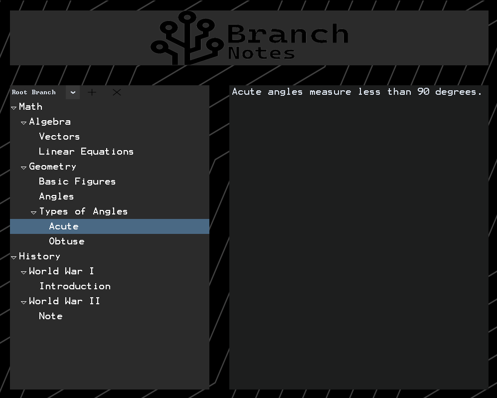
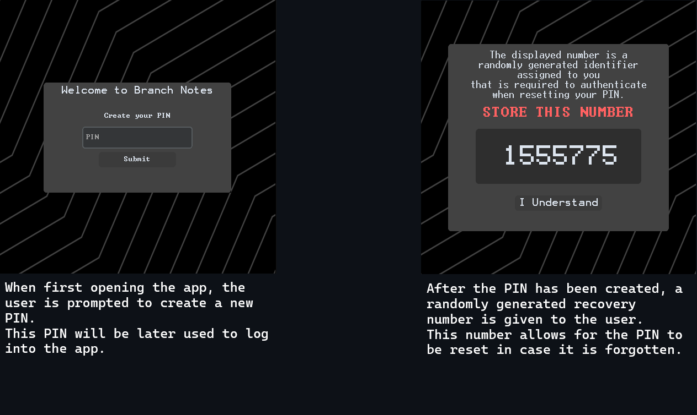
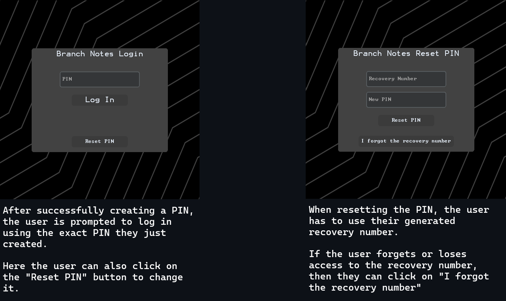
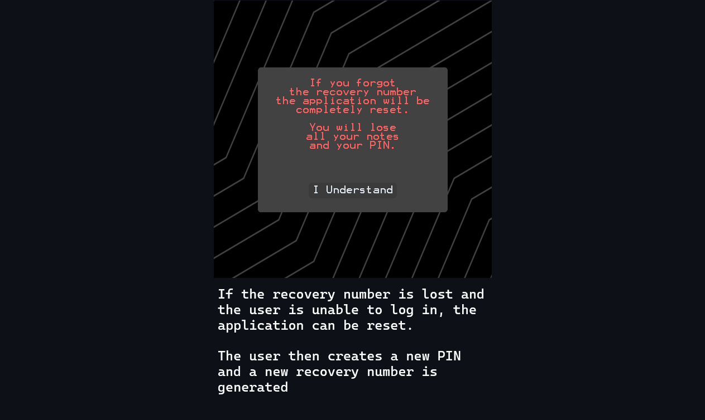
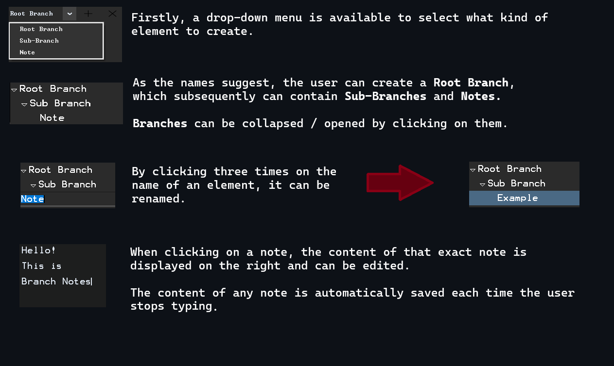
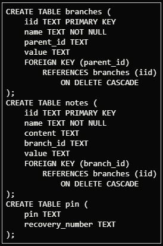

# Branch Notes

### Video:

## Description:
Branch Notes is a user-friendly application designed to streamline note management for any purpose. With Branch Notes, you can effortlessly organize your study notes (or any other type of notes) in a way that suits you best. The app empowers you to create custom hierarchical structures of branches and sub-branches, providing the flexibility to structure and arrange your notes precisely to your liking.
## Key Features:
- **Custom Hierarchy**: You can customize the structure of your branches and notes to your liking.
- **Real-time saving**: Thanks to the integrated SQLite database, your notes are automatically saved 0.5ms after your last keystroke, effectively removing the effort of having to use keybinds or buttons to save your text.
- **User Authentication**: The application utilizes a PIN to authenticate the user, protecting your notes from being snooped on.
- **Recovery Options**: A random recovery number is generated, allowing the user to reset their PIN in case they forget it.
## Techincal Details:
### User Authentication:

### App Usage:

### Code Overview:
Branch Notes is written in **Python** and the GUI is made with **Tkinter** and **CustomTkinter**. A simple **SQLite3** database is integrated to store the user's data and **bcrypt** is used for secure hashing and verification.
#### Modules:
- **branchnotes.py** Contains the main application GUI and logic, from branch and note functionality to database operations for data storage and retrieval.
- **login.py** Contains the GUI and logic for PIN creation, recovery number generation, login, PIN reset and the *last resort* application reset in case the user loses access to the recovery number.
- **main.py** Simply starts the login function.
#### SQLite database:

