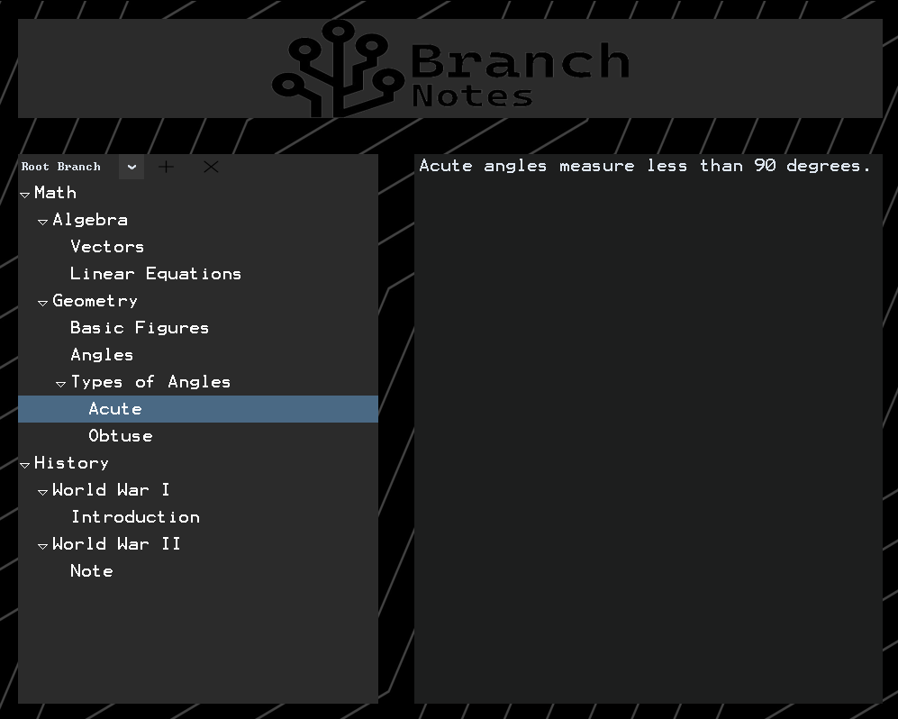
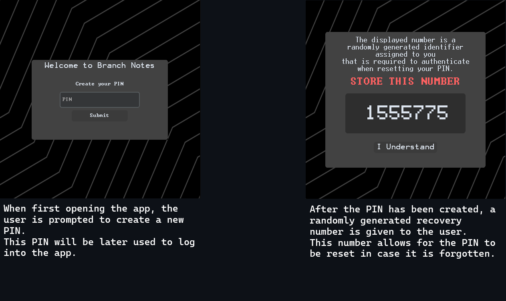
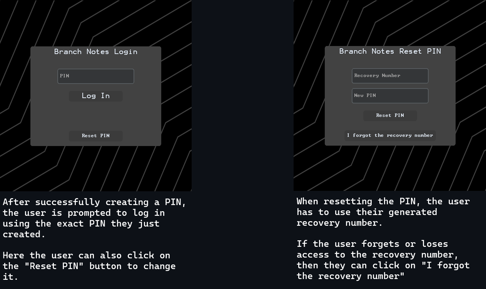
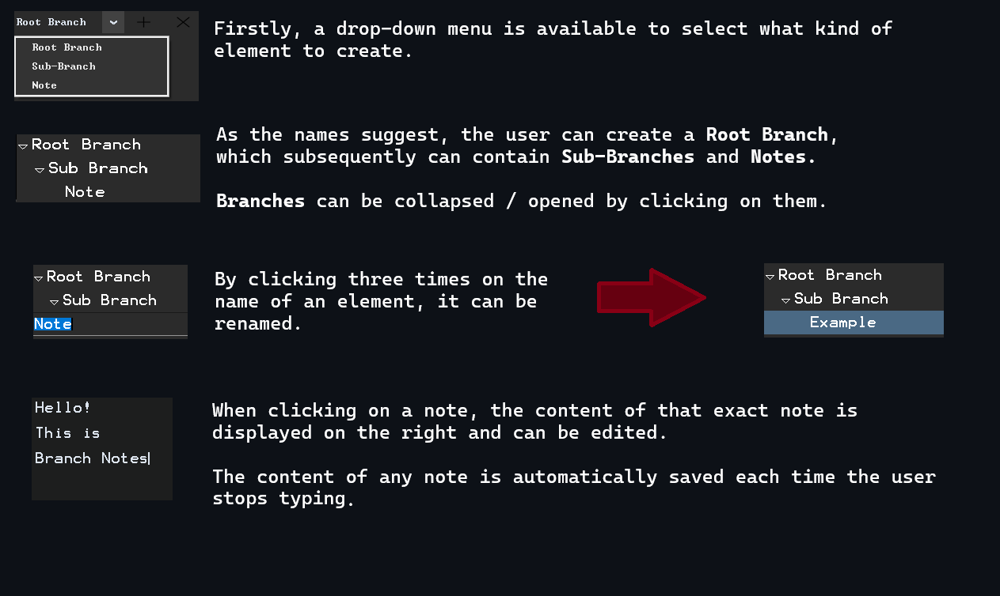
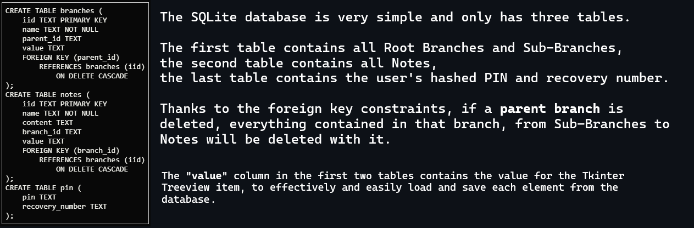

# Branch Notes

### Video demonstration: https://www.youtube.com/watch?v=BopgBRYn1jo

## Description:
Branch Notes is a user-friendly application designed to streamline note management for any purpose. With Branch Notes, you can effortlessly organize your study notes (or any other type of notes) in a way that suits you best. The app empowers you to create custom hierarchical structures of branches and sub-branches, providing the flexibility to structure and arrange your notes precisely to your liking.
## Key Features:
- **Custom Hierarchy**: You can customize the structure of your branches and notes to your liking.
- **Real-time saving**: Thanks to the integrated SQLite database, your notes are automatically saved 0.5ms after your last keystroke, effectively removing the effort of having to use keybinds or buttons to save your text.
- **User Authentication**: The application utilizes a PIN to authenticate the user, protecting your notes from being snooped on.
- **Recovery Options**: A random recovery number is generated, allowing the user to reset their PIN in case they forget it.
## Techincal Details:
### User Authentication:

### App Usage:

### Code Overview:
Branch Notes is written in **Python** and the GUI is made with **Tkinter** and **CustomTkinter**. A simple **SQLite3** database is integrated to store the user's data and **bcrypt** is used for secure hashing and verification.
#### Modules:
- **branchnotes.py** Contains the main application GUI and logic, from branch and note functionality to database operations for data storage and retrieval.
- **login.py** Contains the GUI and logic for PIN creation, recovery number generation, login, PIN reset and the *last resort* application reset in case the user loses access to the recovery number.
- **main.py** Simply starts the login function.
#### SQLite database:

#### Folders:
- **database** Contains the SQLite database
- **images** Contains images used for the app background, icon and buttons.
- **images/readme** Contains all images and screenshots used for this README.
#### Third Party Code:
No code in this project has been **directly copied** from other sources. This is one of my first ever projects and I had to learn a lot of things to be able to create this. Many many tutorials have been watched and many more hours I've spent on making everything work. I used AI assistants such as ChatGPT and taken inspiration and guidance from other people on websites like [Stackoverflow](https://stackoverflow.com/) in certain cases where I felt lost. Everything has been written and created by hand and nothing is copy-pasted. I appreciate and want to thank anybody dedicating their time to read this.
## Conclusions:
### Why Branch Notes?
It's a really simple tool that I personally would use, and it depicts how I would organize my study notes. I've discussed this idea with other people and I decided that it was a simple yet pretty cool idea.
### Improvement Ideas:
I am aware that what I've created isn't anywhere near perfect and it's only a representation of what this small project could be. Of course many more functionalities could be implemented such as saving notes to a file and exporting/importing, adding the ability to use images, changing font and styling the notes in different ways.

